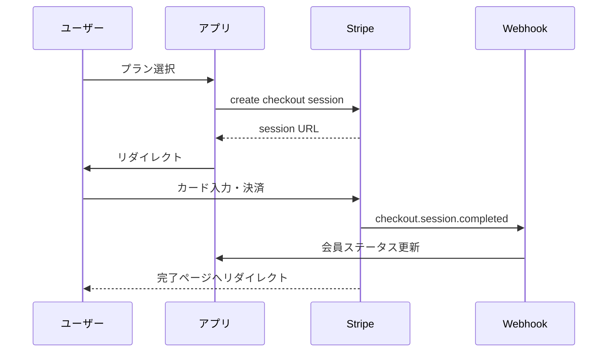

# Stripe サブスクリプション実装フロー

## 全体像



---

## Phase 1: Stripe リソース準備

### 1.1 商品作成

```typescript
// MCP: stripe_create_product
const product = await stripe.products.create({
  name: 'プレミアムプラン',
  description: '全機能が使い放題',
  metadata: {
    app_tier: 'premium'
  }
});
```

### 1.2 価格設定（サブスク）

```typescript
// MCP: stripe_create_price
const price = await stripe.prices.create({
  product: product.id,
  unit_amount: 980,  // 980円
  currency: 'jpy',
  recurring: {
    interval: 'month',  // month | year | week | day
    interval_count: 1
  },
  metadata: {
    plan_type: 'monthly'
  }
});
```

### 1.3 クーポン（任意）

```typescript
// MCP: stripe_create_coupon
const coupon = await stripe.coupons.create({
  percent_off: 50,
  duration: 'once',  // once | repeating | forever
  name: '初回50%OFF'
});
```

---

## Phase 2: Checkout 実装

### 2.1 Checkout Session 作成

```typescript
const session = await stripe.checkout.sessions.create({
  mode: 'subscription',
  payment_method_types: ['card'],
  line_items: [{
    price: priceId,
    quantity: 1
  }],
  success_url: `${baseUrl}/success?session_id={CHECKOUT_SESSION_ID}`,
  cancel_url: `${baseUrl}/cancel`,

  // オプション
  customer_email: user.email,  // 既存顧客なら customer を使用
  subscription_data: {
    trial_period_days: 7,  // 無料トライアル
    metadata: {
      user_id: user.id
    }
  },
  allow_promotion_codes: true,  // クーポンコード入力欄
});
```

### 2.2 リダイレクト

```typescript
// Next.js API Route
export async function POST(req: Request) {
  const session = await createCheckoutSession(user);
  return NextResponse.json({ url: session.url });
}

// フロントエンド
const response = await fetch('/api/checkout', { method: 'POST' });
const { url } = await response.json();
window.location.href = url;
```

---

## Phase 3: Webhook 処理

### 3.1 必須イベント

| イベント | タイミング | 処理 |
|----------|-----------|------|
| `checkout.session.completed` | 初回決済成功 | 会員ステータス更新 |
| `customer.subscription.updated` | プラン変更/更新 | ステータス同期 |
| `customer.subscription.deleted` | 解約完了 | ステータス無効化 |
| `invoice.payment_failed` | 決済失敗 | 警告メール送信 |

### 3.2 署名検証

```typescript
const sig = req.headers['stripe-signature'];
const event = stripe.webhooks.constructEvent(
  body,
  sig,
  process.env.STRIPE_WEBHOOK_SECRET
);
```

---

## Phase 4: 顧客ポータル

解約・プラン変更を顧客自身で行えるように:

```typescript
const portalSession = await stripe.billingPortal.sessions.create({
  customer: customerId,
  return_url: `${baseUrl}/account`
});
```

---

## テストモード確認事項

- [ ] テストカード `4242 4242 4242 4242` で決済成功
- [ ] Webhook がローカルに届く（stripe listen）
- [ ] DB に会員ステータスが反映される
- [ ] 顧客ポータルで解約できる
- [ ] 解約後にステータスが無効になる
